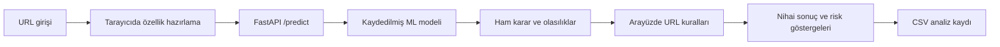
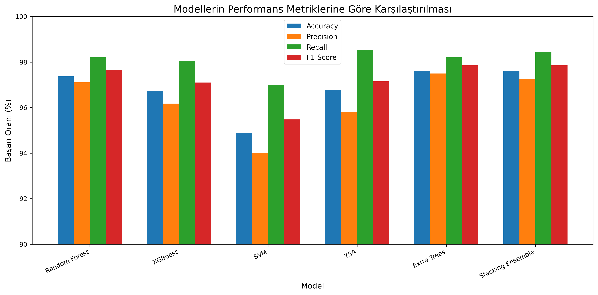

<div align="center">

# PhishGuard ML

**Oltalama analizi · Model karşılaştırması · Açıklanabilir risk göstergeleri**


[](LICENCE)

30 özellikli sınıflandırma modellerini React arayüzü ve FastAPI servisleriyle birleştiren akademik siber güvenlik projesi.

[Mimari](#mimari-ve-karar-akışı) · [Deney sonuçları](#deney-sonuçları) · [Kurulum](#yerel-kurulum) · [Sınırlar](#kapsam-ve-sınırlar)

</div>

---

## Problem ve yaklaşım

Oltalama bağlantılarının değerlendirilmesi için URL göstergeleri ile öğrenilmiş sınıflandırma modelleri birlikte incelenir. Proje; altı modelin karşılaştırılmasını, özellik önemlerinin raporlanmasını ve model kararının kullanıcıya sunulmasını tek bir çalışma akışında toplar.

## Mimari ve karar akışı



- **Eğitim:** ARFF verisi → katmanlı %80/%20 bölme → altı model → F1 ile model seçimi → `best_model.pkl` ve `metrics.json`.
- **API:** URL yerine 30 özellikli JSON kabul eder; model tahmini ve varsa sınıf olasılıklarını döndürür.
- **Arayüz:** URL’den bazı göstergeleri çıkarır, kalan özelliklere varsayılan değerler verir. URL kuralları ham model kararını değiştirebilir.

## Deney sonuçları

Aşağıdaki değerler [metrics.json](metrics.json) dosyasındaki kayıtlı deneyden alınmıştır; bu README düzenlemesinde modeller yeniden eğitilmemiştir.

| Model | Accuracy | Precision | Recall | F1 | ROC-AUC |
|---|---:|---:|---:|---:|---:|
| Random Forest | 97.38% | 97.11% | 98.21% | 97.66% | 99.78% |
| XGBoost | 96.74% | 96.18% | 98.05% | 97.10% | 99.60% |
| SVM | 94.89% | 94.02% | 96.99% | 95.48% | 98.96% |
| YSA | 96.79% | 95.81% | 98.54% | 97.16% | 99.57% |
| Extra Trees | 97.60% | 97.50% | 98.21% | 97.86% | 99.46% |
| Stacking Ensemble | 97.60% | 97.27% | 98.46% | 97.86% | 99.80% |

[train_models.py](train_models.py), `test_size=0.2`, `stratify=y` ve `random_state=42` kullanır. Kayıtlı confusion matrix'lerde test kümesi **2.211 örnektir**. Stacking içinde beş katlı çapraz doğrulama vardır; en iyi model seçimi aynı test kümesindeki F1 üzerinden yapılır. Ayrı bir nihai doğrulama kümesiyle sonuçların teyidi gerekir.

Stacking için kayıtlı matris `[[946, 34], [19, 1212]]` şeklindedir. Kodun pozitif sınıf yorumuna göre yanlış pozitif oranı **34 / 980 = %3,47**’dir. Veri kümesinin etiket semantiği canlı kullanımdan önce ayrıca doğrulanmalıdır.

<details>
<summary><strong>Model karşılaştırma grafiği</strong></summary>



Grafik üretimi: [generate_report_figures.py](generate_report_figures.py). Sayısal sonuçların kaynağı yukarıdaki JSON dosyasıdır.

</details>

## Kodu incelemeye başlayın

| Dosya | İncelenecek konu |
|---|---|
| [train_models.py](train_models.py) | Veri bölme, ensemble tasarımı, model seçimi |
| [backend/main.py](backend/main.py) | Özellik şeması, tahmin API’si, analiz kaydı |
| [Home.jsx](frontend/src/pages/Home.jsx) | URL heuristikleri, karar değişimi ve kullanıcı sunumu |
| [metrics.json](metrics.json) | Model metrikleri, confusion matrix ve özellik önemleri |

## Yerel kurulum

Depoda Python bağımlılıklarını sabitleyen bir requirements dosyası bulunmuyor. Aşağıdaki paketler kodun importlarından türetilen başlangıç kurulumudur; kaydedilmiş modelin üretildiği sürümlerle uyumluluk ayrıca doğrulanmalıdır.

```powershell
git clone https://github.com/silanpehlivan/PhishGuard-ML.git
cd PhishGuard-ML
python -m venv .venv
.\.venv\Scripts\Activate.ps1
python -m pip install fastapi uvicorn pydantic joblib numpy pandas scipy scikit-learn xgboost
python -m uvicorn backend.main:app --reload
```

İkinci terminalde:

```powershell
cd PhishGuard-ML/frontend
npm ci
npm run dev
```

Arayüz: `http://localhost:5173` · API belgeleri: `http://127.0.0.1:8000/docs`.

Eğitimi tekrarlamak için depo kökünde `python train_models.py` çalıştırılır. Bu işlem mevcut model ve metrik dosyalarını yeniden yazar.

## Kapsam ve sınırlar

- Veri seti metrikleri, canlı URL akışının doğruluğunu ölçmez; eğitim özellikleri ile tarayıcıda hazırlanan özelliklerin dağılımı farklıdır.
- HTTPS göstergesi URL protokolünden türetilir; TLS sertifikası doğrulaması veya canlı sayfa taraması yapılmış olduğu anlamına gelmez.
- Arayüzde gösterilen güven değeri model olasılığı ve heuristik hesaplarla değiştirilir; kalibre edilmiş saldırı olasılığı olarak yorumlanmamalıdır.
- API’de kimlik doğrulama ve rate limiting bulunmaz; CORS yapılandırması geniştir. Mevcut yapı yerel akademik prototiptir.
- Analiz kayıtları URL’leri saklar. Gerçek kullanıcı verileri için veri minimizasyonu ve kayıt politikası belirlenmelidir.
- Joblib/pickle modeli yalnızca güvenilir kaynaktan yüklenmelidir.

## Geliştiriciler

Şilan PEHLİVAN · Semanur YILDIRIM · İlayda ÖZTÜRK  
Ders sorumlusu: Dr. Öğr. Üyesi Emine AYAZ

---

**© 2026 Şilan PEHLİVAN, Semanur YILDIRIM ve İlayda ÖZTÜRK**  
Kullanım ve dağıtım koşulları: [MIT lisansı](LICENCE).
